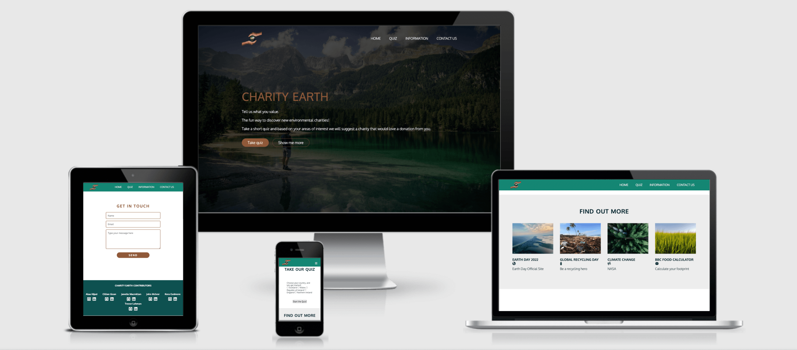
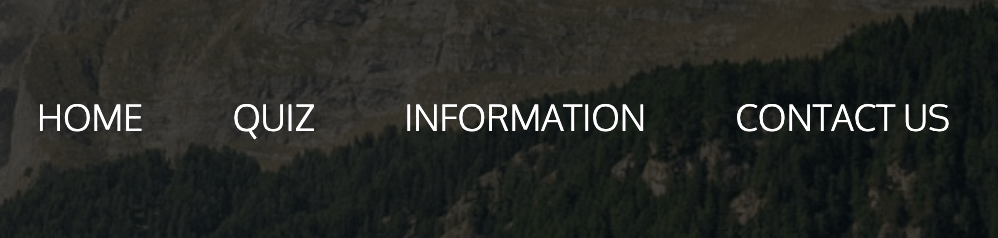

# Charity Earth

Charity Earth was created as part of the April 2022 Earth Day Hackathon held by the Code Institute.

Charity Earth - Tell us what you value - The fun way to discover new environmental charities! Take a short quiz and based on your areas of interest we will suggest a charity that would love a donation from you.

Don't have any spare funds but still want to contribute? Select to donate your time instead! Want to donate to a specific area of the UK? We can help you find the right charity for that area.

Visit the deployed site: [Charity Earth](https://kera-cudmore.github.io/earth-day-hackathon-2022/)

## CONTENTS

* [User Experience](#User-Experience)
  * [User Stories](#User-Stories)

* [Design](#Design)
  * [Colour Scheme](#Colour-Scheme)
  * [Typography](#Typography)
  * [Imagery](#Imagery)
  * [Wireframes](#Wireframes)
  * [Features](#Features)
  * [Accessibility](#Accessibility)

* [Technologies Used](#Technologies-Used)
  * [Languages Used](#Languages-Used)
  * [Frameworks, Libraries & Programs Used](#Frameworks,-Libraries-&-Programs-Used)

* [Deployment & Local Development](#Deployment-&-Local-Development)
  * [Deployment](#Deployment)
  * [Local Development](#Local-Development)
    * [How to Fork](#How-to-Fork)
    * [How to Clone](#How-to-Clone)

* [Testing](#Testing)
  * [W3C Validator](#W3C-Validator)
  * [JavaScript Validator](#JavaScript-Validator)
  * [Solved Bugs](#Solved-Bugs)
  * [Known Bugs](#Known-Bugs)
  * [Testing User Stories](#Testing-User-Stories)
  * [Lighthouse](#Lighthouse)
  * [Full Testing](#Full-Testing)
  
* [Credits](#Credits)
  * [Code Used](#Code-Used)
  * [Content](#Content)
  * [Media](#Media)
  * [Acknowledgments](#Acknowledgments)

- - -

## User Experience

### User Stories

#### First Time Visitor Goals

* To quickly and easily discover charities that are local to me, that have an environmental focus, and which reflect my values and interests, without having to research and compare a range of organisations.

* To be profiled for these recommendations through a light-hearted, multiple choice quiz.

* To be presented with a link to my recommended organisation’s website.

* To feel secure in the knowledge that my recommended organisation is a legitimate,  registered charity.

* To  be able to easily navigate back to the homepage after completing the quiz if I wish to repeat the quiz with different answers.

* To have a means of learning more about Earth Day, and its theme for 2022, as well as a resource for discovering more organisations that work in these areas.

#### Returning Visitor Goals

* To be able to access a full list of the charities for my area of choice, without having to navigate the quiz repeatedly to get different results.

* To have different quiz questions presented to me based on my earlier choices in the quiz, creating a sense a variety that encourages repeat use.

- - -

## Design

### Colour Scheme

We wanted to choose colours that reflected the environment, so we have chosen a variety of greens, blues and browns for our site.

### Typography

Google Fonts was used to import the chosen fonts for use in the site.

We have chosen to use the oxygen font. This is a sans serif font which is great for accessibility and dyslexic users. We also felt the name was very fitting for use on our site for Earth Day 😊.

### Imagery

All imagery used within the site has been chosen to showcase the beautiful nature of Earth.

All charity images used belong to their respective charitites.

### Wireframes

Wireframes were created for mobile, tablet and desktop using Balsamiq.

Index Page Wireframe

 

Quiz Screen Wireframe

 

End of Quiz Wireframe

 

Result Wireframe

 

404 Error Page Wireframe

 

### Features

The website is comprised of 7 pages, the index page, 5 charity themed pages and the 404 page.

The index page is divided into sections, the hero image, the quiz, the information section and the contact section.

The quiz is started when the user selects the location they wish to find a charity in. After the user submits this form and sets their location, they will be presented with their first multiple choice quiz question, where each answer corresponds to one of the 5 themes of Earth Day 2022. They will answer 5 of these "pick-one-of-three" questions, with each answer increasing their tally for a given theme. Next, the user answers whether they are seeking to find a charity to volunteer with, or to make donations towards. If there is "tie" in the results of their quiz, a final tiebreaker question will be displayed, which will offer the user a multiple choice question that only features answers that correspond to the "tied" scores the user has in the quiz. Once the tie is broken, or in the case that there is no tie to begin with, the user is presented with a button offering to take them to their results. The url attached to the button is generated using their chosen location, preferred "donation" type, and the theme they chose through completing the rest of the quiz.   

The 404 page lets the user know that there has been an error and gives them the option through a choice of buttons to be redirected to the home page, the quiz section, the information section and the contact us section.

* All Pages on the website have:

  * A favicon. We have chosen to use an image of the Earth to tie our site in the with Earth Day theme of the hackathon.

    

  * A navbar. This allows the user to easily navigate through the site. On mobile devices the navbar collapses down into a toggle navbar.

    

  * A footer. The footer contains links to the the teams GitHub and Linked In accounts.

    

* Future Implementations.

### Accessibility

We have been mindful during coding to ensure that the website is as accessible friendly as possible. This has been have achieved by:

* Using semantic HTML.
* Using descriptive alt attributes on images on the site.
* Providing information for screen readers where there are icons used and no text. This has been actioned in the footer of our project.
* Ensuring that there is a sufficient colour contrast throughout the site.

- - -

## Technologies Used

### Languages Used

HTML, CSS, Javascript

### Frameworks, Libraries & Programs Used

Balsamiq - Used to create wireframes.

Git - For version control.

Github - To save and store the files for the website.

[Coolors](https://coolors.co/) - To select the colour palette for the site.

Google Fonts - To import the fonts used on the website.

Font Awesome - For the iconography on the website.

Google Dev Tools - To troubleshoot and test features, solve issues with responsiveness and styling.

[Tiny PNG](https://tinypng.com/) To compress images.

[Birme](https://www.birme.net/?target_width=640&target_height=480&no_resize=true&image_format=webp) To compress images in the webp format.

[Favicon.io](https://favicon.io/) To create favicon.

[Am I Responsive?](http://ami.responsivedesign.is/) To show the website image on a range of devices.

[Shields.io](https://shields.io/) To add badges to the README

[remove.bg](https://www.remove.bg/) To remove the background from the logo image

- - -

## Deployment & Local Development

### Deployment

The site is deployed using GitHub Pages. Visit the deployed site [here.](https://kera-cudmore.github.io/earth-day-hackathon-2022/)

### Local Development

#### How to Fork

To fork the repository:

1. Log in (or sign up) to Github.
2. Go to the repository for this project, [earth-day-hackathon-2022](https://github.com/kera-cudmore/earth-day-hackathon-2022).
3. Click the Fork button in the top right corner.

#### How to Clone

To clone the repository:

1. Log in (or sign up) to GitHub.
2. Go to the repository for this project, [earth-day-hackathon-2022](https://github.com/kera-cudmore/earth-day-hackathon-2022).
3. Click on the code button, select whether you would like to clone with HTTPS, SSH or GitHub CLI and copy the link shown.
4. Open the terminal in your code editor and change the current working directory to the location you want to use for the cloned directory.
5. Type 'git clone' into the terminal and then paste the link you copied in step 3. Press enter.

- - -

## Testing

Please view [Testing.md](TESTING.md) for the testing documentation.

- - -

## Credits

### Code Used

### Content

The content for the site was created by the team. Biographies for each charity were taken from the charities website.

### Media

* [Header Image](https://unsplash.com/photos/0DtcZKzrP6Y) used on the index page and 404 page
* [Logo Image](https://pxhere.com/en/photo/1093799)
* [additional-1](https://unsplash.com/photos/RUqoVelx59I)
* [additional-2](https://unsplash.com/photos/WJkc3xZjSXw)
* [additional-3](https://unsplash.com/photos/9UkTV-18AeM)
* [additional-4](https://unsplash.com/photos/qTyR49889Ck)

* All Charity Logo images were taken from each charities websites.

### Acknowledgments

We would like to thank the following people:

* [Suzy](https://github.com/suzybee1987) Our hackathon facilitator
* Our families for their endless patience as we disappeared for a weekend to code
* The Code Institute Hackathon team for putting on these wonderful events to allow us to develop our skills within an agile development environment.

Meet team 5 Hackathon Newbies & Me!

* [Alaa](https://github.com/Hijazi-alaa)
* [Cillian](https://github.com/Cillian-G)
* [Janelle](https://github.com/JanelleG51)
* [John](https://github.com/johnjmci)
* [Kera](https://github.com/kera-cudmore)
* [Trevor](https://github.com/trevthedev777)
