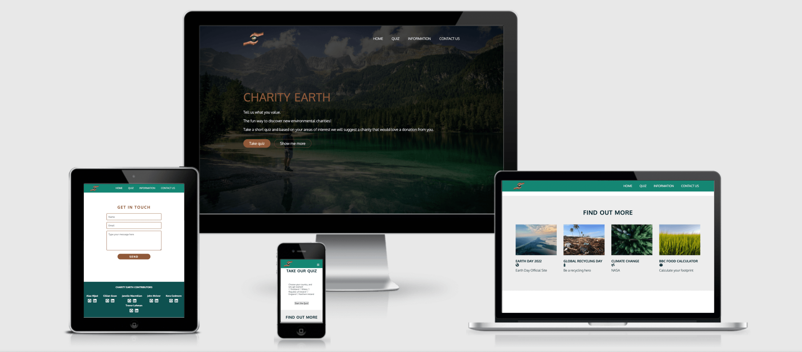

# Charity Earth -  Testing

Visit the deployed site: [Charity Earth](https://kera-cudmore.github.io/earth-day-hackathon-2022/index.html)

- - -

## CONTENTS

* [AUTOMATED TESTING](#AUTOMATED-TESTING)
  * [W3C Validator](#W3C-Validator)
  * [JavaScript Validator](#JavaScript-Validator)
  * [Lighthouse](#Lighthouse)
  * [WAVE](#WAVE)
* [MANUAL TESTING](#MANUAL-TESTING)
  * [Testing User Stories](#Testing-User-Stories)
  * [Full Testing](#Full-Testing)
* [Bugs](#Bugs)
  * [Known Bugs](#Known-Bugs)
  * [Solved Bugs](#Solved-Bugs)

Testing was ongoing throughout the entire build. We utilised Chrome developer tools whilst building to pinpoint and troubleshoot any issues as we went along.

During development we made use of google developer tools to ensure everything was working correctly and to assist with troubleshooting when things were not working as expected.

We utilised the console in the developer tools to work through small sections of JavaScript and ensure that the code was working, and also to troubleshoot where issues were.

We have gone through each page using google chrome developer tools to ensure that each page is responsive on a variety of different screen sizes and devices.

We have also used WAVE to check the accessibility of our site, together with W3 Validator to check the HMTL & CSS, and JShint to validate the JavaScript.

- - -

## AUTOMATED TESTING

### W3C Validator

[W3C](https://validator.w3.org/) was used to validate the HTML on all pages of the website. It was also used to validate the CSS.

* [Index Page](https://validator.w3.org/nu/?showsource=yes&doc=https%3A%2F%2Fkera-cudmore.github.io%2Fearth-day-hackathon-2022%2Findex.html)
* [Climate Change Page](https://validator.w3.org/nu/?showsource=yes&doc=https%3A%2F%2Fkera-cudmore.github.io%2Fearth-day-hackathon-2022%2Fclimatechange.html)
* [Conservation Restoration Page](https://validator.w3.org/nu/?doc=https%3A%2F%2Fkera-cudmore.github.io%2Fearth-day-hackathon-2022%2Fconservationrestoration.html)
* [End Plastic Page](https://validator.w3.org/nu/?showsource=yes&doc=https%3A%2F%2Fkera-cudmore.github.io%2Fearth-day-hackathon-2022%2Fendplastic.html)
* [Environmental Literacy Page](https://validator.w3.org/nu/?doc=https%3A%2F%2Fkera-cudmore.github.io%2Fearth-day-hackathon-2022%2Fenvironmentalliteracy.html)
* [Food & Environment Page](https://validator.w3.org/nu/?doc=https%3A%2F%2Fkera-cudmore.github.io%2Fearth-day-hackathon-2022%2Ffoodenvironment)
* [404 Page](https://validator.w3.org/nu/?doc=https%3A%2F%2Fkera-cudmore.github.io%2Fearth-day-hackathon-2022%2F404.html)

* [Style.css](readme/testing/w3-css.png)

- - -

### JavaScript Validator

[jshint](https://jshint.com/) was used to validate the JavaScript.

* [script.js]
* [sendEmail.js](readme/testing/email-js.png)

- - -

### Lighthouse

We used Lighthouse within the Chrome Developer Tools to test the performance, accessibility, best practices and SEO of the website.

### Desktop Results

* [Index Page](readme/testing/lighthouse/lighthouse-desktop-index.png)
* [Climate Change Page](readme/testing/lighthouse/lighthouse-desktop-climatechange.png)
* [Conservation Restoration Page](readme/testing/lighthouse/lighthouse-desktop-conservation.png)
* [End Plastic Page](readme/testing/lighthouse/lighthouse-desktop-endplastic.png)
* [Environmental Literacy Page](readme/testing/lighthouse/lighthouse-desktop-enviroliteracy.png)
* [Food & Environment Page](readme/testing/lighthouse/lighthouse-desktop-foodenvironment.png)
* [404 Page](readme/testing/lighthouse/lighthouse-desktop-404.png)

### Mobile Results

* [Index Page](readme/testing/lighthouse/lighthouse-mobile-index.png)
* [Climate Change Page](readme/testing/lighthouse/lighthouse-mobile-climatechange.png)
* [Conservation Restoration Page](readme/testing/lighthouse/lighthouse-mobile-conservation.png)
* [End Plastic Page](readme/testing/lighthouse/lighthouse-mobile-endplastic.png)
* [Environmental Literacy Page](readme/testing/lighthouse/lighthouse-mobile-enviroliteracy.png)
* [Food & Environment Page](readme/testing/lighthouse/lighthouse-mobile-foodenvironment.png)
* [404 Page](readme/testing/lighthouse/lighthouse-mobile-404.png)

- - -

### WAVE

Each page was run through the Web Accessibility Evalulation Tool (WAVE).

The alerts that are raised on each page are to do with having adjacent links going to the same URL. This is due to having the one transparent nav on the hero image and then the coloured navbar that appears when you scroll past the hero image.

* [Index Page]
* [Climate Change Page](readme/testing/wave/wave-climatechange.png)
* [Conservation Restoration Page](readme/testing/wave/wave-conservation.png)
* [End Plastic Page](readme/testing/wave/wave-endplastic.png)
* [Environmental Literacy Page](readme/testing/wave/wave-envirolit.png)
* [Food & Environment Page](readme/testing/wave/wave-foodenviro.png)
* [404 Page](readme/testing/wave/wave-404.png)

- - -

## MANUAL TESTING

### Testing User Stories

`First Time Visitors`

| Goals | How are they achieved? | Links & Images |
| :--- | :--- | :--- |
| To quickly and easily discover charities that are local to me, that have an environmental focus, and which reflect my values and interests, without having to research and compare a range of organisations. | By selecting the area that the user would like to discover charities in during the first question of the quiz, the user will then be given a personalised charity result based on the area they selected, this is then combined with their selections for the rest of the questions to direct them to a charity that focuses on an environmental cause that they would be interested in. | [Quiz Section Image](readme/testing/user-stories-area.png) |
| To be profiled for these recommendations through a light-hearted, multiple choice quiz. | We decided that we would like to present the quiz in the style of a buzzfeed quiz, rather than asking users outright to select their preferences of charity type, we have created the questions so that the answer leads towards a certain type of charity. | [Quiz Question Example Image](readme/testing/user-stories-question.png) |
| To be presented with a link to my recommended organisation’s website. | Upon completion of the quiz the user is then redirected to the relevant page for their charity. ID's have been used to target the correct section of the page that the user is being redirected to, so that when the page opens it will automatically display the right section of the page. | [Quiz Results Image](readme/testing/user-stories-quiz-results.png) |
| To feel secure in the knowledge that my recommended organisation is a legitimate,  registered charity. | All Charities have been thoroughly researched and we have ensured that each charity is currently running and is registered on the relevent governments charity register.   | [Charity Research Spreadsheet](https://docs.google.com/spreadsheets/d/1PVfykTEjhAZT__f2wiTC8DxzqeNkVgD_EtOPIMHBkMw/edit?usp=sharing) |
| To  be able to easily navigate back to the homepage after completing the quiz if I wish to repeat the quiz with different answers. | Each page contains the navbar that allows the user to redirect to the home page when ready. | [Navbar Image](readme/navbar.png) |
| To have a means of learning more about Earth Day, and its theme for 2022, as well as a resource for discovering more organisations that work in these areas. | A link to the official Earth Day website is included in the information section of the home page. |[Earth Day Site Image](readme/testing/earth-day-link.png) |

`Returning Visitors`

*We hope to implement features in a future implementation that will address the requirements of returning visitiors.*

| Goals | How are they achieved? | Images |
| :--- | :--- | :--- |
| To be able to access a full list of the charities for my area of choice, without having to navigate the quiz repeatedly to get different results. | To Be Implemented | - |
| To have different quiz questions presented to me based on my earlier choices in the quiz, creating a sense a variety that encourages repeat use. | To Be Implemented | - |

- - -

### Full Testing

Full testing was performed on the following devices, and additional testing for other devices was carried out using developer tools:

iMac 2021, MacBook Pro 14 inch 2021, iPhone 13 Pro, Samsung S20, 25 inch monitor, windows laptop

Each device tested the site using the following browsers:

Google Chrome on Mac and Windows, Safari

`Index Page`

| Feature | Expected Outcome | Testing Performed | Result | Pass/Fail |
| --- | --- | --- | --- | --- |
| **NAVBAR** |  |  |  |  |
|  |  |  |  |  |
| Logo image link | When clicked you are redirected to the home page | Clicked Logo | Redirected to home page | Pass|
| Navbar home link | When clicked you are redirected to the home page | Clicked link | Redirected to home page | Pass |
| Navbar home link - Hover | When hovered over a line will appear under the link | Hovered over link | Line appeared under link | Pass |
| Navbar quiz link | When clicked you are redirected to the Quiz Section of the home page | Clicked link | Redirected to quiz section of home page | Pass |
| Navbar quiz link - hover | When hovered over a line will appear under the link | Hovered over link | Line appeared under link | Pass |
| Navbar information link | When clicked you are redirected to the Information section of the home page | Clicked link | Redirected to information section of home page | Pass |
| Navbar information link - hover | When hovered over a line will appear under the link | Hovered over link | Line appeared under link | Pass |
| Navbar contact us link | When clicked you are redirected to the Contact Us section of the home page | Clicked link | Redirected to contact us section of home page | Pass |
| Navbar contact us link - hover | When hovered over a line will appear under the link | Hovered over link | Line appeared under link | Pass |
|  |  |  |  |  |
| **HERO IMAGE BUTTONS** |  |  |  |  |
|  |  |  |  |  |
| Take quiz button | Directs to quiz section of home page | Clicked button | Directed to quiz section of home page | Pass |
| Take quiz button - hover | When hovered over button changes colour | Hovered over button | Button changes colour | Pass |
| Show me more button | Directs to the information section of home page | Clicked button | Taken to information section of home page | Pass |
| Show me more button - hover | When hovered over button changes colour | Hovered over button | Button changes colour | Pass |
|  |  |  |  |  |
| **QUIZ** |  |  |  |  |
|  |  |  |  |  |
| --- | --- | --- | --- | --- |
|  |  |  |  |  |
| **INFORMATION SECTION - FIND OUT MORE** |  |  |  |  |
|  |  |  |  |  |
| Earth Day 2022 Image | When clicked you are redirected to the page in a new tab | Clicked image | Page opens in a new tab | Pass |
| Earth Day 2022 Text | When clicked you are redirected to the page in a new tab | Clicked text | Page opens in a new tab | Pass |
| Global Recycling Day Image | When clicked you are redirected to the page in a new tab | Clicked image | Page opens in a new tab | Pass |
| Global Recycling Day Text | When clicked you are redirected to the page in a new tab | Clicked text | Page opens in a new tab | Pass |
| Climate Change Image | When clicked you are redirected to the page in a new tab | Clicked image | Page opens in a new tab | Pass |
| Climate Change Text | When clicked you are redirected to the page in a new tab | Clicked text | Page opens in a new tab | Pass |
| BBC Food Calculator Image | When clicked you are redirected to the page in a new tab | Clicked image | Page opens in a new tab | Pass |
| BBC Food Calculator Text | When clicked you are redirected to the page in a new tab | Clicked text | Page opens in a new tab | Pass |
|  |  |  |  |  |
| **CONTACT US** |  |  |  |  |
|  |  |  |  |  |
| Submit Form Button - No information entered by user | The form will direct the user to fill in the name field | Clicked submit button with no information filled in | Asked to fill in name field | Pass |
| Submit Form Button - Some information entered | User will be directed to fill in the fields they have left blank | Filled in only part of the form | Asked to fill in the missing fields | Pass |
| Submit form button - all fields filled out | Modal pop up with message confirming message successfully sent | Filled in all forms and pressed submit | Modal popped up with success message | Pass |
| Submit button - hover | when hovered over the button changes colour | Hovered over button | Button changed colour | Pass |
| Name input - focus | When input field is clicked on the border of the input field will change colour | Clicked on input field | Border changed colour | Pass |
| Email input - focus | When input field is clicked on the border of the input field will change colour | Clicked on input field | Border changed colour | Pass |
| Text Area - focus |When text area is clicked on the border of the text area will change colour | Clicked on text area | Border changed colour | Pass |
|  |  |  |  |  |
| **FOOTER** |  |  |  |  |
|  |  |  |  |  |
| Alaa GitHub Icon | When clicked you will be redirected to Alaas GitHub profile in a new tab | Clicked icon | Profile opened in a new tab | Pass |
| Alaa GitHub Icon - hover | When hovered over a line will appear under the icon | Hovered over icon | Line appeared | Pass |
| Alaa Linked In Icon | When clicked you will be redirected to Alaas Linked In profile in a new tab | Clicked icon | Profile opened in a new tab | Pass |
| Alaa Linked In Icon - hover | When hovered over a line will appear under the icon | Hovered over icon | Line appeared | Pass |
| Cillian GitHub Icon | When clicked you will be redirected to Cillians GitHub profile in a new tab | Clicked icon | Profile opened in a new tab | Pass |
| Cillian GitHub Icon - hover | When hovered over a line will appear under the icon | Hovered over icon | Line appeared | Pass |
| Cillian Linked In Icon | When clicked you will be redirected to Cillians Linked In profile in a new tab | --Clicked icon- | Profile opened in a new tab | Pass |
| Cillian Linked In Icon - hover | When hovered over a line will appear under the icon | Hovered over icon | Line appeared | Pass |
| Janelle GitHub Icon | When clicked you will be redirected to Janelles GitHub profile in a new tab | Clicked icon | Profile opened in a new tab | Pass |
| Janelle GitHub Icon - hover | When hovered over a line will appear under the icon | Hovered over icon | Line appeared | Pass |
| Janelle Linked In Icon | When clicked you will be redirected to Janelles Linked In profile in a new tab | Clicked icon | Profile opened in a new tab | Pass |
| Janelle Linked In Icon - hover | When hovered over a line will appear under the icon | Hovered over icon | Line appeared | Pass |
| John GitHub Icon | When clicked you will be redirected to Johns GitHub profile in a new tab | Clicked icon | Profile opened in a new tab | Pass |
| John GitHub Icon - hover | When hovered over a line will appear under the icon | Hovered over icon | Line appeared | Pass |
| John Linked In Icon | When clicked you will be redirected to Johns Linked In profile in a new tab | Clicked icon | Profile opened in a new tab | Pass |
| John Linked In Icon - hover | When hovered over a line will appear under the icon | Hovered over icon | Line appeared | Pass |
| Kera GitHub Icon | When clicked you will be redirected to Keras GitHub profile in a new tab | Clicked icon | Profile opened in a new tab | Pass |
| Kera GitHub Icon - hover | When hovered over a line will appear under the icon | Hovered over icon | Line appeared | Pass |
| Kera Linked In Icon | When clicked you will be redirected to Keras Linked In profile in a new tab | Clicked icon | Profile opened in a new tab | Pass |
| Kera Linked In Icon - hover | When hovered over a line will appear under the icon | Hovered over icon | Line appeared | Pass |
| Trevor GitHub Icon | When clicked you will be redirected to Trevors GitHub profile in a new tab | Clicked icon | Profile opened in a new tab | Pass |
| Trevor GitHub Icon - hover | When hovered over a line will appear under the icon | Hovered over icon | Line appeared | Pass |
| Trevor Linked In Icon | When clicked you will be redirected to Trevors Linked In profile in a new tab | Clicked icon | Profile opened in a new tab | Pass |
| Trevor Linked In Icon - hover | When hovered over a line will appear under the icon | Hovered over icon | Line appeared | Pass |

`Climate Change Charities Page`

| Feature | Expected Outcome | Testing Performed | Result | Pass/Fail |
| --- | --- | --- | --- | --- |
| **NAVBAR** |  |  |  |  |
|  |  |  |  |  |
| Logo image link | When clicked you are redirected to the home page | Clicked Logo | Redirected to home page | Pass|
| Navbar home link | When clicked you are redirected to the home page | Clicked link | Redirected to home page | Pass |
| Navbar home link - Hover | When hovered over a line will appear under the link | Hovered over link | Line appeared under link | Pass |
| Navbar quiz link | When clicked you are redirected to the Quiz Section of the home page | Clicked link | Redirected to quiz section of home page | Pass |
| Navbar quiz link - hover | When hovered over a line will appear under the link | Hovered over link | Line appeared under link | Pass |
| Navbar information link | When clicked you are redirected to the Information section of the home page | Clicked link | Redirected to information section of home page | Pass |
| Navbar information link - hover | When hovered over a line will appear under the link | Hovered over link | Line appeared under link | Pass |
| Navbar contact us link | When clicked you are redirected to the Contact Us section of the home page | Clicked link | Redirected to contact us section of home page | Pass |
| Navbar contact us link - hover | When hovered over a line will appear under the link | Hovered over link | Line appeared under link | Pass |
|  |  |  |  |  |
| **FOOTER** |  |  |  |  |
|  |  |  |  |  |
| Alaa GitHub Icon | When clicked you will be redirected to Alaas GitHub profile in a new tab | Clicked icon | Profile opened in a new tab | Pass |
| Alaa GitHub Icon - hover | When hovered over a line will appear under the icon | Hovered over icon | Line appeared | Pass |
| Alaa Linked In Icon | When clicked you will be redirected to Alaas Linked In profile in a new tab | Clicked icon | Profile opened in a new tab | Pass |
| Alaa Linked In Icon - hover | When hovered over a line will appear under the icon | Hovered over icon | Line appeared | Pass |
| Cillian GitHub Icon | When clicked you will be redirected to Cillians GitHub profile in a new tab | Clicked icon | Profile opened in a new tab | Pass |
| Cillian GitHub Icon - hover | When hovered over a line will appear under the icon | Hovered over icon | Line appeared | Pass |
| Cillian Linked In Icon | When clicked you will be redirected to Cillians Linked In profile in a new tab | --Clicked icon- | Profile opened in a new tab | Pass |
| Cillian Linked In Icon - hover | When hovered over a line will appear under the icon | Hovered over icon | Line appeared | Pass |
| Janelle GitHub Icon | When clicked you will be redirected to Janelles GitHub profile in a new tab | Clicked icon | Profile opened in a new tab | Pass |
| Janelle GitHub Icon - hover | When hovered over a line will appear under the icon | Hovered over icon | Line appeared | Pass |
| Janelle Linked In Icon | When clicked you will be redirected to Janelles Linked In profile in a new tab | Clicked icon | Profile opened in a new tab | Pass |
| Janelle Linked In Icon - hover | When hovered over a line will appear under the icon | Hovered over icon | Line appeared | Pass |
| John GitHub Icon | When clicked you will be redirected to Johns GitHub profile in a new tab | Clicked icon | Profile opened in a new tab | Pass |
| John GitHub Icon - hover | When hovered over a line will appear under the icon | Hovered over icon | Line appeared | Pass |
| John Linked In Icon | When clicked you will be redirected to Johns Linked In profile in a new tab | Clicked icon | Profile opened in a new tab | Pass |
| John Linked In Icon - hover | When hovered over a line will appear under the icon | Hovered over icon | Line appeared | Pass |
| Kera GitHub Icon | When clicked you will be redirected to Keras GitHub profile in a new tab | Clicked icon | Profile opened in a new tab | Pass |
| Kera GitHub Icon - hover | When hovered over a line will appear under the icon | Hovered over icon | Line appeared | Pass |
| Kera Linked In Icon | When clicked you will be redirected to Keras Linked In profile in a new tab | Clicked icon | Profile opened in a new tab | Pass |
| Kera Linked In Icon - hover | When hovered over a line will appear under the icon | Hovered over icon | Line appeared | Pass |
| Trevor GitHub Icon | When clicked you will be redirected to Trevors GitHub profile in a new tab | Clicked icon | Profile opened in a new tab | Pass |
| Trevor GitHub Icon - hover | When hovered over a line will appear under the icon | Hovered over icon | Line appeared | Pass |
| Trevor Linked In Icon | When clicked you will be redirected to Trevors Linked In profile in a new tab | Clicked icon | Profile opened in a new tab | Pass |
| Trevor Linked In Icon - hover | When hovered over a line will appear under the icon | Hovered over icon | Line appeared | Pass |

`Conservation and Restoration Charities Page`

| Feature | Expected Outcome | Testing Performed | Result | Pass/Fail |
| --- | --- | --- | --- | --- |
| **NAVBAR** |  |  |  |  |
|  |  |  |  |  |
| Logo image link | When clicked you are redirected to the home page | Clicked Logo | Redirected to home page | Pass|
| Navbar home link | When clicked you are redirected to the home page | Clicked link | Redirected to home page | Pass |
| Navbar home link - Hover | When hovered over a line will appear under the link | Hovered over link | Line appeared under link | Pass |
| Navbar quiz link | When clicked you are redirected to the Quiz Section of the home page | Clicked link | Redirected to quiz section of home page | Pass |
| Navbar quiz link - hover | When hovered over a line will appear under the link | Hovered over link | Line appeared under link | Pass |
| Navbar information link | When clicked you are redirected to the Information section of the home page | Clicked link | Redirected to information section of home page | Pass |
| Navbar information link - hover | When hovered over a line will appear under the link | Hovered over link | Line appeared under link | Pass |
| Navbar contact us link | When clicked you are redirected to the Contact Us section of the home page | Clicked link | Redirected to contact us section of home page | Pass |
| Navbar contact us link - hover | When hovered over a line will appear under the link | Hovered over link | Line appeared under link | Pass |
|  |  |  |  |  |
| **FOOTER** |  |  |  |  |
|  |  |  |  |  |
| Alaa GitHub Icon | When clicked you will be redirected to Alaas GitHub profile in a new tab | Clicked icon | Profile opened in a new tab | Pass |
| Alaa GitHub Icon - hover | When hovered over a line will appear under the icon | Hovered over icon | Line appeared | Pass |
| Alaa Linked In Icon | When clicked you will be redirected to Alaas Linked In profile in a new tab | Clicked icon | Profile opened in a new tab | Pass |
| Alaa Linked In Icon - hover | When hovered over a line will appear under the icon | Hovered over icon | Line appeared | Pass |
| Cillian GitHub Icon | When clicked you will be redirected to Cillians GitHub profile in a new tab | Clicked icon | Profile opened in a new tab | Pass |
| Cillian GitHub Icon - hover | When hovered over a line will appear under the icon | Hovered over icon | Line appeared | Pass |
| Cillian Linked In Icon | When clicked you will be redirected to Cillians Linked In profile in a new tab | --Clicked icon- | Profile opened in a new tab | Pass |
| Cillian Linked In Icon - hover | When hovered over a line will appear under the icon | Hovered over icon | Line appeared | Pass |
| Janelle GitHub Icon | When clicked you will be redirected to Janelles GitHub profile in a new tab | Clicked icon | Profile opened in a new tab | Pass |
| Janelle GitHub Icon - hover | When hovered over a line will appear under the icon | Hovered over icon | Line appeared | Pass |
| Janelle Linked In Icon | When clicked you will be redirected to Janelles Linked In profile in a new tab | Clicked icon | Profile opened in a new tab | Pass |
| Janelle Linked In Icon - hover | When hovered over a line will appear under the icon | Hovered over icon | Line appeared | Pass |
| John GitHub Icon | When clicked you will be redirected to Johns GitHub profile in a new tab | Clicked icon | Profile opened in a new tab | Pass |
| John GitHub Icon - hover | When hovered over a line will appear under the icon | Hovered over icon | Line appeared | Pass |
| John Linked In Icon | When clicked you will be redirected to Johns Linked In profile in a new tab | Clicked icon | Profile opened in a new tab | Pass |
| John Linked In Icon - hover | When hovered over a line will appear under the icon | Hovered over icon | Line appeared | Pass |
| Kera GitHub Icon | When clicked you will be redirected to Keras GitHub profile in a new tab | Clicked icon | Profile opened in a new tab | Pass |
| Kera GitHub Icon - hover | When hovered over a line will appear under the icon | Hovered over icon | Line appeared | Pass |
| Kera Linked In Icon | When clicked you will be redirected to Keras Linked In profile in a new tab | Clicked icon | Profile opened in a new tab | Pass |
| Kera Linked In Icon - hover | When hovered over a line will appear under the icon | Hovered over icon | Line appeared | Pass |
| Trevor GitHub Icon | When clicked you will be redirected to Trevors GitHub profile in a new tab | Clicked icon | Profile opened in a new tab | Pass |
| Trevor GitHub Icon - hover | When hovered over a line will appear under the icon | Hovered over icon | Line appeared | Pass |
| Trevor Linked In Icon | When clicked you will be redirected to Trevors Linked In profile in a new tab | Clicked icon | Profile opened in a new tab | Pass |
| Trevor Linked In Icon - hover | When hovered over a line will appear under the icon | Hovered over icon | Line appeared | Pass |

`End Plastic Pollution Charities Page`

| Feature | Expected Outcome | Testing Performed | Result | Pass/Fail |
| --- | --- | --- | --- | --- |
| **NAVBAR** |  |  |  |  |
|  |  |  |  |  |
| Logo image link | When clicked you are redirected to the home page | Clicked Logo | Redirected to home page | Pass|
| Navbar home link | When clicked you are redirected to the home page | Clicked link | Redirected to home page | Pass |
| Navbar home link - Hover | When hovered over a line will appear under the link | Hovered over link | Line appeared under link | Pass |
| Navbar quiz link | When clicked you are redirected to the Quiz Section of the home page | Clicked link | Redirected to quiz section of home page | Pass |
| Navbar quiz link - hover | When hovered over a line will appear under the link | Hovered over link | Line appeared under link | Pass |
| Navbar information link | When clicked you are redirected to the Information section of the home page | Clicked link | Redirected to information section of home page | Pass |
| Navbar information link - hover | When hovered over a line will appear under the link | Hovered over link | Line appeared under link | Pass |
| Navbar contact us link | When clicked you are redirected to the Contact Us section of the home page | Clicked link | Redirected to contact us section of home page | Pass |
| Navbar contact us link - hover | When hovered over a line will appear under the link | Hovered over link | Line appeared under link | Pass |
|  |  |  |  |  |
| **FOOTER** |  |  |  |  |
|  |  |  |  |  |
| Alaa GitHub Icon | When clicked you will be redirected to Alaas GitHub profile in a new tab | Clicked icon | Profile opened in a new tab | Pass |
| Alaa GitHub Icon - hover | When hovered over a line will appear under the icon | Hovered over icon | Line appeared | Pass |
| Alaa Linked In Icon | When clicked you will be redirected to Alaas Linked In profile in a new tab | Clicked icon | Profile opened in a new tab | Pass |
| Alaa Linked In Icon - hover | When hovered over a line will appear under the icon | Hovered over icon | Line appeared | Pass |
| Cillian GitHub Icon | When clicked you will be redirected to Cillians GitHub profile in a new tab | Clicked icon | Profile opened in a new tab | Pass |
| Cillian GitHub Icon - hover | When hovered over a line will appear under the icon | Hovered over icon | Line appeared | Pass |
| Cillian Linked In Icon | When clicked you will be redirected to Cillians Linked In profile in a new tab | --Clicked icon- | Profile opened in a new tab | Pass |
| Cillian Linked In Icon - hover | When hovered over a line will appear under the icon | Hovered over icon | Line appeared | Pass |
| Janelle GitHub Icon | When clicked you will be redirected to Janelles GitHub profile in a new tab | Clicked icon | Profile opened in a new tab | Pass |
| Janelle GitHub Icon - hover | When hovered over a line will appear under the icon | Hovered over icon | Line appeared | Pass |
| Janelle Linked In Icon | When clicked you will be redirected to Janelles Linked In profile in a new tab | Clicked icon | Profile opened in a new tab | Pass |
| Janelle Linked In Icon - hover | When hovered over a line will appear under the icon | Hovered over icon | Line appeared | Pass |
| John GitHub Icon | When clicked you will be redirected to Johns GitHub profile in a new tab | Clicked icon | Profile opened in a new tab | Pass |
| John GitHub Icon - hover | When hovered over a line will appear under the icon | Hovered over icon | Line appeared | Pass |
| John Linked In Icon | When clicked you will be redirected to Johns Linked In profile in a new tab | Clicked icon | Profile opened in a new tab | Pass |
| John Linked In Icon - hover | When hovered over a line will appear under the icon | Hovered over icon | Line appeared | Pass |
| Kera GitHub Icon | When clicked you will be redirected to Keras GitHub profile in a new tab | Clicked icon | Profile opened in a new tab | Pass |
| Kera GitHub Icon - hover | When hovered over a line will appear under the icon | Hovered over icon | Line appeared | Pass |
| Kera Linked In Icon | When clicked you will be redirected to Keras Linked In profile in a new tab | Clicked icon | Profile opened in a new tab | Pass |
| Kera Linked In Icon - hover | When hovered over a line will appear under the icon | Hovered over icon | Line appeared | Pass |
| Trevor GitHub Icon | When clicked you will be redirected to Trevors GitHub profile in a new tab | Clicked icon | Profile opened in a new tab | Pass |
| Trevor GitHub Icon - hover | When hovered over a line will appear under the icon | Hovered over icon | Line appeared | Pass |
| Trevor Linked In Icon | When clicked you will be redirected to Trevors Linked In profile in a new tab | Clicked icon | Profile opened in a new tab | Pass |
| Trevor Linked In Icon - hover | When hovered over a line will appear under the icon | Hovered over icon | Line appeared | Pass |

`Environmental Literacy Charities Page`

| Feature | Expected Outcome | Testing Performed | Result | Pass/Fail |
| --- | --- | --- | --- | --- |
| **NAVBAR** |  |  |  |  |
|  |  |  |  |  |
| Logo image link | When clicked you are redirected to the home page | Clicked Logo | Redirected to home page | Pass|
| Navbar home link | When clicked you are redirected to the home page | Clicked link | Redirected to home page | Pass |
| Navbar home link - Hover | When hovered over a line will appear under the link | Hovered over link | Line appeared under link | Pass |
| Navbar quiz link | When clicked you are redirected to the Quiz Section of the home page | Clicked link | Redirected to quiz section of home page | Pass |
| Navbar quiz link - hover | When hovered over a line will appear under the link | Hovered over link | Line appeared under link | Pass |
| Navbar information link | When clicked you are redirected to the Information section of the home page | Clicked link | Redirected to information section of home page | Pass |
| Navbar information link - hover | When hovered over a line will appear under the link | Hovered over link | Line appeared under link | Pass |
| Navbar contact us link | When clicked you are redirected to the Contact Us section of the home page | Clicked link | Redirected to contact us section of home page | Pass |
| Navbar contact us link - hover | When hovered over a line will appear under the link | Hovered over link | Line appeared under link | Pass |
|  |  |  |  |  |
| **FOOTER** |  |  |  |  |
|  |  |  |  |  |
| Alaa GitHub Icon | When clicked you will be redirected to Alaas GitHub profile in a new tab | Clicked icon | Profile opened in a new tab | Pass |
| Alaa GitHub Icon - hover | When hovered over a line will appear under the icon | Hovered over icon | Line appeared | Pass |
| Alaa Linked In Icon | When clicked you will be redirected to Alaas Linked In profile in a new tab | Clicked icon | Profile opened in a new tab | Pass |
| Alaa Linked In Icon - hover | When hovered over a line will appear under the icon | Hovered over icon | Line appeared | Pass |
| Cillian GitHub Icon | When clicked you will be redirected to Cillians GitHub profile in a new tab | Clicked icon | Profile opened in a new tab | Pass |
| Cillian GitHub Icon - hover | When hovered over a line will appear under the icon | Hovered over icon | Line appeared | Pass |
| Cillian Linked In Icon | When clicked you will be redirected to Cillians Linked In profile in a new tab | --Clicked icon- | Profile opened in a new tab | Pass |
| Cillian Linked In Icon - hover | When hovered over a line will appear under the icon | Hovered over icon | Line appeared | Pass |
| Janelle GitHub Icon | When clicked you will be redirected to Janelles GitHub profile in a new tab | Clicked icon | Profile opened in a new tab | Pass |
| Janelle GitHub Icon - hover | When hovered over a line will appear under the icon | Hovered over icon | Line appeared | Pass |
| Janelle Linked In Icon | When clicked you will be redirected to Janelles Linked In profile in a new tab | Clicked icon | Profile opened in a new tab | Pass |
| Janelle Linked In Icon - hover | When hovered over a line will appear under the icon | Hovered over icon | Line appeared | Pass |
| John GitHub Icon | When clicked you will be redirected to Johns GitHub profile in a new tab | Clicked icon | Profile opened in a new tab | Pass |
| John GitHub Icon - hover | When hovered over a line will appear under the icon | Hovered over icon | Line appeared | Pass |
| John Linked In Icon | When clicked you will be redirected to Johns Linked In profile in a new tab | Clicked icon | Profile opened in a new tab | Pass |
| John Linked In Icon - hover | When hovered over a line will appear under the icon | Hovered over icon | Line appeared | Pass |
| Kera GitHub Icon | When clicked you will be redirected to Keras GitHub profile in a new tab | Clicked icon | Profile opened in a new tab | Pass |
| Kera GitHub Icon - hover | When hovered over a line will appear under the icon | Hovered over icon | Line appeared | Pass |
| Kera Linked In Icon | When clicked you will be redirected to Keras Linked In profile in a new tab | Clicked icon | Profile opened in a new tab | Pass |
| Kera Linked In Icon - hover | When hovered over a line will appear under the icon | Hovered over icon | Line appeared | Pass |
| Trevor GitHub Icon | When clicked you will be redirected to Trevors GitHub profile in a new tab | Clicked icon | Profile opened in a new tab | Pass |
| Trevor GitHub Icon - hover | When hovered over a line will appear under the icon | Hovered over icon | Line appeared | Pass |
| Trevor Linked In Icon | When clicked you will be redirected to Trevors Linked In profile in a new tab | Clicked icon | Profile opened in a new tab | Pass |
| Trevor Linked In Icon - hover | When hovered over a line will appear under the icon | Hovered over icon | Line appeared | Pass |

`Food & Environment Charities Page`

| Feature | Expected Outcome | Testing Performed | Result | Pass/Fail |
| --- | --- | --- | --- | --- |
| **NAVBAR** |  |  |  |  |
|  |  |  |  |  |
| Logo image link | When clicked you are redirected to the home page | Clicked Logo | Redirected to home page | Pass|
| Navbar home link | When clicked you are redirected to the home page | Clicked link | Redirected to home page | Pass |
| Navbar home link - Hover | When hovered over a line will appear under the link | Hovered over link | Line appeared under link | Pass |
| Navbar quiz link | When clicked you are redirected to the Quiz Section of the home page | Clicked link | Redirected to quiz section of home page | Pass |
| Navbar quiz link - hover | When hovered over a line will appear under the link | Hovered over link | Line appeared under link | Pass |
| Navbar information link | When clicked you are redirected to the Information section of the home page | Clicked link | Redirected to information section of home page | Pass |
| Navbar information link - hover | When hovered over a line will appear under the link | Hovered over link | Line appeared under link | Pass |
| Navbar contact us link | When clicked you are redirected to the Contact Us section of the home page | Clicked link | Redirected to contact us section of home page | Pass |
| Navbar contact us link - hover | When hovered over a line will appear under the link | Hovered over link | Line appeared under link | Pass |
|  |  |  |  |  |
| **FOOTER** |  |  |  |  |
|  |  |  |  |  |
| Alaa GitHub Icon | When clicked you will be redirected to Alaas GitHub profile in a new tab | Clicked icon | Profile opened in a new tab | Pass |
| Alaa GitHub Icon - hover | When hovered over a line will appear under the icon | Hovered over icon | Line appeared | Pass |
| Alaa Linked In Icon | When clicked you will be redirected to Alaas Linked In profile in a new tab | Clicked icon | Profile opened in a new tab | Pass |
| Alaa Linked In Icon - hover | When hovered over a line will appear under the icon | Hovered over icon | Line appeared | Pass |
| Cillian GitHub Icon | When clicked you will be redirected to Cillians GitHub profile in a new tab | Clicked icon | Profile opened in a new tab | Pass |
| Cillian GitHub Icon - hover | When hovered over a line will appear under the icon | Hovered over icon | Line appeared | Pass |
| Cillian Linked In Icon | When clicked you will be redirected to Cillians Linked In profile in a new tab | --Clicked icon- | Profile opened in a new tab | Pass |
| Cillian Linked In Icon - hover | When hovered over a line will appear under the icon | Hovered over icon | Line appeared | Pass |
| Janelle GitHub Icon | When clicked you will be redirected to Janelles GitHub profile in a new tab | Clicked icon | Profile opened in a new tab | Pass |
| Janelle GitHub Icon - hover | When hovered over a line will appear under the icon | Hovered over icon | Line appeared | Pass |
| Janelle Linked In Icon | When clicked you will be redirected to Janelles Linked In profile in a new tab | Clicked icon | Profile opened in a new tab | Pass |
| Janelle Linked In Icon - hover | When hovered over a line will appear under the icon | Hovered over icon | Line appeared | Pass |
| John GitHub Icon | When clicked you will be redirected to Johns GitHub profile in a new tab | Clicked icon | Profile opened in a new tab | Pass |
| John GitHub Icon - hover | When hovered over a line will appear under the icon | Hovered over icon | Line appeared | Pass |
| John Linked In Icon | When clicked you will be redirected to Johns Linked In profile in a new tab | Clicked icon | Profile opened in a new tab | Pass |
| John Linked In Icon - hover | When hovered over a line will appear under the icon | Hovered over icon | Line appeared | Pass |
| Kera GitHub Icon | When clicked you will be redirected to Keras GitHub profile in a new tab | Clicked icon | Profile opened in a new tab | Pass |
| Kera GitHub Icon - hover | When hovered over a line will appear under the icon | Hovered over icon | Line appeared | Pass |
| Kera Linked In Icon | When clicked you will be redirected to Keras Linked In profile in a new tab | Clicked icon | Profile opened in a new tab | Pass |
| Kera Linked In Icon - hover | When hovered over a line will appear under the icon | Hovered over icon | Line appeared | Pass |
| Trevor GitHub Icon | When clicked you will be redirected to Trevors GitHub profile in a new tab | Clicked icon | Profile opened in a new tab | Pass |
| Trevor GitHub Icon - hover | When hovered over a line will appear under the icon | Hovered over icon | Line appeared | Pass |
| Trevor Linked In Icon | When clicked you will be redirected to Trevors Linked In profile in a new tab | Clicked icon | Profile opened in a new tab | Pass |
| Trevor Linked In Icon - hover | When hovered over a line will appear under the icon | Hovered over icon | Line appeared | Pass |

`404 Page`

| Feature | Expected Outcome | Testing Performed | Result | Pass/Fail |
| --- | --- | --- | --- | --- |
| **NAVBAR** |  |  |  |  |
|  |  |  |  |  |
| Logo image link | When clicked you are redirected to the home page | Clicked Logo | Redirected to home page | Pass|
| Navbar home link | When clicked you are redirected to the home page | Clicked link | Redirected to home page | Pass |
| Navbar home link - Hover | When hovered over a line will appear under the link | Hovered over link | Line appeared under link | Pass |
| Navbar quiz link | When clicked you are redirected to the Quiz Section of the home page | Clicked link | Redirected to quiz section of home page | Pass |
| Navbar quiz link - hover | When hovered over a line will appear under the link | Hovered over link | Line appeared under link | Pass |
| Navbar information link | When clicked you are redirected to the Information section of the home page | Clicked link | Redirected to information section of home page | Pass |
| Navbar information link - hover | When hovered over a line will appear under the link | Hovered over link | Line appeared under link | Pass |
| Navbar contact us link | When clicked you are redirected to the Contact Us section of the home page | Clicked link | Redirected to contact us section of home page | Pass |
| Navbar contact us link - hover | When hovered over a line will appear under the link | Hovered over link | Line appeared under link | Pass |
|  |  |  |  |  |
| **PAGE BUTTONS** |  |  |  |  |
|  |  |  |  |  |
| Go back home button | When clicked you are redirected to the home page | Clicked button | Redirected to home page | Pass |
| Go back home button - hover | When hovered over the button will change colour | Hovered over button | Button changed colour | Pass |
| Take quiz button | When clicked you are redirected to the quiz section on the home page | Clicked button | Redirected to the quiz section of the home page | Pass |
| Take quiz button - hover | When hovered over the button will change colour | Hovered over button | Button changed colour | Pass |
| Information button | When clicked you are redirected to the information section on the home page | Clicked button | Redirected to the information section of the home page | Pass |
| Information button - hover | When hovered over the button will change colour | Hovered over button | Button changed colour | Pass |
| Contact us button | When clicked you are redirected to the contact us section on the home page | Clicked button | Redirected to the contact us section of the home page | Pass |
| Contact us button - hover | When hovered over the button will change colour | Hovered over button | Button changed colour | Pass |
|  |  |  |  |  |
| **FOOTER** |  |  |  |  |
|  |  |  |  |  |
| Alaa GitHub Icon | When clicked you will be redirected to Alaas GitHub profile in a new tab | Clicked icon | Profile opened in a new tab | Pass |
| Alaa GitHub Icon - hover | When hovered over a line will appear under the icon | Hovered over icon | Line appeared | Pass |
| Alaa Linked In Icon | When clicked you will be redirected to Alaas Linked In profile in a new tab | Clicked icon | Profile opened in a new tab | Pass |
| Alaa Linked In Icon - hover | When hovered over a line will appear under the icon | Hovered over icon | Line appeared | Pass |
| Cillian GitHub Icon | When clicked you will be redirected to Cillians GitHub profile in a new tab | Clicked icon | Profile opened in a new tab | Pass |
| Cillian GitHub Icon - hover | When hovered over a line will appear under the icon | Hovered over icon | Line appeared | Pass |
| Cillian Linked In Icon | When clicked you will be redirected to Cillians Linked In profile in a new tab | --Clicked icon- | Profile opened in a new tab | Pass |
| Cillian Linked In Icon - hover | When hovered over a line will appear under the icon | Hovered over icon | Line appeared | Pass |
| Janelle GitHub Icon | When clicked you will be redirected to Janelles GitHub profile in a new tab | Clicked icon | Profile opened in a new tab | Pass |
| Janelle GitHub Icon - hover | When hovered over a line will appear under the icon | Hovered over icon | Line appeared | Pass |
| Janelle Linked In Icon | When clicked you will be redirected to Janelles Linked In profile in a new tab | Clicked icon | Profile opened in a new tab | Pass |
| Janelle Linked In Icon - hover | When hovered over a line will appear under the icon | Hovered over icon | Line appeared | Pass |
| John GitHub Icon | When clicked you will be redirected to Johns GitHub profile in a new tab | Clicked icon | Profile opened in a new tab | Pass |
| John GitHub Icon - hover | When hovered over a line will appear under the icon | Hovered over icon | Line appeared | Pass |
| John Linked In Icon | When clicked you will be redirected to Johns Linked In profile in a new tab | Clicked icon | Profile opened in a new tab | Pass |
| John Linked In Icon - hover | When hovered over a line will appear under the icon | Hovered over icon | Line appeared | Pass |
| Kera GitHub Icon | When clicked you will be redirected to Keras GitHub profile in a new tab | Clicked icon | Profile opened in a new tab | Pass |
| Kera GitHub Icon - hover | When hovered over a line will appear under the icon | Hovered over icon | Line appeared | Pass |
| Kera Linked In Icon | When clicked you will be redirected to Keras Linked In profile in a new tab | Clicked icon | Profile opened in a new tab | Pass |
| Kera Linked In Icon - hover | When hovered over a line will appear under the icon | Hovered over icon | Line appeared | Pass |
| Trevor GitHub Icon | When clicked you will be redirected to Trevors GitHub profile in a new tab | Clicked icon | Profile opened in a new tab | Pass |
| Trevor GitHub Icon - hover | When hovered over a line will appear under the icon | Hovered over icon | Line appeared | Pass |
| Trevor Linked In Icon | When clicked you will be redirected to Trevors Linked In profile in a new tab | Clicked icon | Profile opened in a new tab | Pass |
| Trevor Linked In Icon - hover | When hovered over a line will appear under the icon | Hovered over icon | Line appeared | Pass |

## Bugs

### Known Bugs

| Known Bug No | Bug Issue | Plan to Resolve |
| :--- | :--- | :--- |
| 1 |  | :--- |

### Solved Bugs

| Bug No | Bug Issue | How Resolved |
| :--- | :--- | :--- |
| 1 |  | :--- |

Back to [README.md](README.md)
